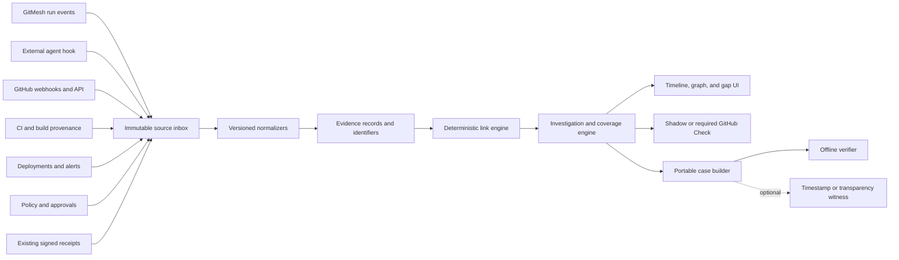

# GitMesh Pivot: Change Control for Coding Agents

**Decision date:** 2026-07-14
**Research cutoff:** 2026-07-14
**Status:** Active implementation and user validation; D0 secure evidence foundation is next
**This document is the canonical pivot strategy, market review, product plan, and validation architecture.**

## How To Use This Document

| Reader or need | Read these sections |
|---|---|
| Understand the pivot in five minutes | 1, 2, 5, 6, 7, and 19 |
| Explain the market decision | 3, 4, 5, and 16 |
| Decide what to keep or remove | 8 and 9 |
| Plan implementation | 10, 11, 13, and 15 |
| Evaluate adoption and business risk | 6, 11, 12, 14, 16, and 19 |
| Audit the research | 3, 4, and 18 |

**Current stage:** implementation and customer validation run in parallel. Build the read-only evidence path now, one independently verifiable change at a time, while interviews and design-partner work continuously refine priorities.

## 1. The Decision

GitMesh should stop positioning itself as the operating system for autonomous AI companies. It should also not become a generic AI security gateway, observability platform, compliance ledger, or fleet manager.

The recommended experiment is:

> **GitMesh Change Control** is a self-hosted change-governance and evidence layer for engineering teams using multiple coding agents. It connects agent work to commits, pull requests, CI checks, spend, approvals, deployments, and incidents. It applies policy at boundaries that can actually enforce a decision, and it produces a portable case showing what was observed, allowed, reviewed, shipped, and left unknown.

The product starts read-only. A team connects one GitHub repository and one coding-agent source, then GitMesh reconstructs:

```text
request or task
  -> coding-agent session
  -> tool activity
  -> commit
  -> pull request
  -> CI checks and build
  -> policy and human review
  -> merge and deployment
  -> production outcome or incident
```

If users retain that workflow, GitMesh adds a shadow GitHub Check. Only after teams trust the result does the check become an optional required merge gate.

The strategy in one sentence is:

> **Evidence is the low-friction entry. Change governance is the recurring workflow. Portable audit is the downstream differentiator.**

## 2. Why GitMesh Must Change

### The current product is too broad

GitMesh currently tries to manage complete AI organizations:

- agent registry and org chart;
- tasks, goals, comments, and assignment;
- heartbeat execution and adapters;
- policies and approvals;
- costs and budgets;
- activity logs and attestations;
- forge synchronization;
- an operator dashboard.

That creates three adoption problems:

1. A new user must adopt a new operating model before receiving value.
2. The product competes with GitHub, Microsoft, AWS, ServiceNow, Salesforce, IBM, agent runtimes, workflow products, and coding-agent fleet platforms at the same time.
3. The phrase "control plane for autonomous projects" does not identify one urgent job or budget owner.

### The original Agent Trail pivot was also too broad

The first pivot proposed an open flight recorder that would capture every agent action, sign it, explain the cause of incidents, replay policy, and export compliance evidence.

Independent research rejected its strongest claims:

- signed agent receipts and recorder proxies already exist;
- no config-only integration captures every action;
- OpenTelemetry data can be sampled or dropped;
- signatures prove integrity of presented bytes, not event truth or completeness;
- current failure-attribution research cannot reliably prove the decisive step;
- regulations request logs and oversight, but generally not cryptographic receipts;
- demand for independent receipts has not been established with buyers.

### A broad coding-agent fleet control plane is occupied too

A later proposal recommended a vendor-neutral governance plane for Claude Code, Codex, Cursor, Devin, Copilot, and internal agents.

It correctly identified spend, review, policy, and attribution problems. However, the market already contains Tembo, Ona, Factory, Coder, GitHub Agent HQ, Cursor, Devin, OpenHands Enterprise, Pipelock, Future AGI, and enterprise suites with overlapping capabilities.

The remaining opportunity is not "one console for every agent." It is a narrower workflow that these products only partially solve: governing and explaining the promotion of an agent-authored software change across vendor boundaries.

## 3. Evidence Standard Used In This Research

All conclusions in this document use four labels:

- **Verified fact:** supported by source code, a primary product document, a standard, a regulation, or a paper.
- **Vendor claim:** stated by a vendor but not independently tested.
- **Inference:** a conclusion drawn from verified facts, with uncertainty.
- **Hypothesis:** important but not yet validated with users or implementation evidence.

Important limits:

- Vendor documentation proves what a vendor publishes, not efficacy or adoption.
- GitHub stars and package downloads are not production users or customers.
- A missing competitor in this review is not proof that one does not exist.
- A large market category does not prove demand for this specific GitMesh workflow.
- Technical feasibility does not prove willingness to install, retain, or pay.

## 4. What The Market Research Found

### 4.1 Market summary

| Category | State | GitMesh decision |
|---|---|---|
| General agent control planes | Occupied by hyperscalers and enterprise platforms | Exit |
| Coding-agent fleet operation | Active and rapidly developing | Do not build another fleet console |
| Agent security and guardrails | Crowded and consolidating through acquisitions | Integrate, do not enter |
| LLM and agent observability | Saturated, with OTel becoming the common ingestion layer | Consume telemetry |
| MCP and model gateways | Crowded and commoditizing | Build plugins, not another gateway |
| Signed agent receipts | Technically populated but commercially immature | Import existing formats |
| GRC and compliance mapping | Established vendors own control workflows | Export evidence later |
| Task and PR cost attribution | Useful but increasingly available through gateways and native products | Include as a feature, not the category |
| Cross-source coding-change evidence and promotion policy | Pieces exist, but the combined workflow remains less mature | Validate this narrow position |

### 4.2 Direct fleet and control-plane competitors

| Product | Verified or publicly documented capabilities | Strategic lesson |
|---|---|---|
| [Tembo](https://www.tembo.io/) | Multi-agent engineering platform for Claude Code, Codex, Cursor, OpenCode, Pi, Amp, and others; isolated machines; review workflows; logs; usage analytics; GitHub, GitLab, and Bitbucket; cloud and packaged self-hosting. Public plans are $0, $60, $200, and enterprise. Air-gap support is a vendor claim; public self-host docs describe a Tembo image, license, and release endpoint. | Closest broad direct competitor. Do not compete on "one place to run every agent." |
| [Ona](https://ona.com/docs) | Isolated agent environments, organization policy, hard command denies, process-level enforcement, SSO/SCIM, audit, approvals, and MCP controls. Agreement to be acquired by OpenAI announced June 2026. | Deep runtime governance is occupied. Neutrality can also disappear through ownership. |
| [Factory](https://factory.ai/) | Organization policy, endpoint/model restrictions, command blocks, autonomy ceilings, hooks, DLP, confirmations, OTLP, and enterprise deployment options around Factory's Droid runtime. | Strong runtime-centered control plane. |
| [Coder AI Governance](https://coder.com/docs/ai-coder/ai-governance) | Self-hosted AI Gateway and Agent Firewall; credentials, prompt/tool/token audit, approved MCPs, spend views, and process network controls inside Coder workspaces. | Strong self-hosted enforcement boundary. |
| [GitHub Agent HQ](https://github.com/features/agent-hq) | GitHub-native agent tasks, sessions, policies, MCP controls, audit events, and metered product budgets. The enterprise agent control plane entered public preview in October 2025; no later GA notice was found at cutoff. Local IDE agents are outside it. | GitHub owns the forge workflow and sets user expectations. GitMesh must add cross-source value. |
| [Cursor Enterprise](https://cursor.com/enterprise) | Cursor agent controls, MCP/model/repository policies, spend limits, audit, and analytics. Full control plane remains Cursor SaaS. | Strong single-vendor governance. |
| [Devin](https://docs.devin.ai/) | Agent Command Center, local and cloud agents, RBAC, audit APIs, session costs, and session/org caps. Third-party ACP actions remain controlled by those runtimes. | Multi-agent surface already exists, but evidence across systems remains fragmented. |
| [OpenHands Agent Canvas](https://github.com/OpenHands/agent-canvas) | Open-source browser UI for OpenHands and ACP agents. Multi-user RBAC, budgets, and isolated backends belong to commercial OpenHands Enterprise, not the OSS canvas. | Do not confuse OSS coordination with enterprise governance. |
| [Future AGI](https://github.com/future-agi/future-agi) | Apache-2.0 model gateway/control center with keys, routing, guardrails, request logs, costs, rate limits, and spend caps. Early testing status. | Open model-path governance exists, but shell/Git/deploy paths can bypass it. |
| [Conductor](https://conductor.build/docs) | Mac worktree-based coordination for several coding agents with local plan/tool approval and diff review. | Evidence of coordination demand, not deep governance. |
| [Vibe Kanban](https://github.com/BloopAI/vibe-kanban) | Popular local multi-agent coordination and PR workflow. Company shut down in April 2026; shutdown post said most users were free and no attractive business model emerged. | Adoption of a fleet UI does not prove willingness to pay. |
| [Terragon](https://github.com/terragon-labs/terragon-oss) | Former containerized multi-agent orchestration service. Hosted service shut down in February 2026. | Thin orchestration is not a durable position. |

### 4.3 Direct evidence and receipt competitors

These projects disprove the original claim that signed, portable agent evidence was an empty category:

| Project | Relevant capabilities | Main limitation |
|---|---|---|
| [Pipelock](https://github.com/luckyPipewrench/pipelock) | HTTP, WebSocket, MCP, and A2A mediation; sandboxing; policy; signed RFC 8785 receipts; chains; checkpoints; audit packets; multiple verifiers; incident views; policy replay; coverage certificates. | Proves mediated paths, not bypassed behavior or real-world outcome truth. |
| [MakerChecker](https://github.com/makerchecker/MakerChecker) | RBAC, segregation of duties, approvals, RFC 8785 records, Ed25519 chains, bundles, and offline verification. | Covers governed calls and reported outcomes. |
| [Signet](https://github.com/Prismer-AI/signet) | Signed tool calls, hash chains, delegation, policy attestations, MCP middleware, bundles, and optional server co-signing. | Agent signing proves intent; target co-signing is required for target observation. |
| [Obsigna / Agent Receipts](https://github.com/agent-receipts/obsigna) | Open receipt protocol, isolated signing daemon, MCP proxy, hooks, three SDKs, conformance corpus, and explicit trust model. | Completeness depends on routing and signer isolation. |
| [ScopeBlind](https://github.com/ScopeBlind/scopeblind-gateway) | Cedar policy, exact-action approvals, signed receipts, selective disclosure, anchoring, simulation, bundles, and reports. | Limited to configured hook and MCP paths. |
| Keel, AGA, Aevum, Aegis, Sello, cMCP, ToolWarden, aiAuthZ, NOA, AERF, and AgentLedger variants | Different combinations of permits, closures, chains, timestamps, checkpoints, verification, and evidence mappings. | Mostly early projects with little public adoption and different trust boundaries. |
| TrustWarden AgentLedger | No public repository or primary technical artifact was found; the named domain redirected to a marketplace at cutoff. | Treat the claimed S3/DynamoDB/KMS architecture as unverified. |

### 4.4 Security, identity, policy, and gateways

Security is crowded and being absorbed into established vendors:

- Zenity, WitnessAI, Noma, Lasso, Pillar, Operant, and EQTY Lab compete directly for security and governance budgets.
- Snyk acquired Invariant Labs.
- F5 announced CalypsoAI acquisition.
- Check Point acquired Lakera.
- Palo Alto Networks acquired Protect AI and Koi and announced Portkey acquisition intent.
- Cisco acquired Robust Intelligence.
- Cato acquired Aim Security.

Identity and authorization are also active categories:

- Microsoft Entra Agent ID, Astrix, Token Security, Aembit, Oasis, Descope, Auth0, and Okta cover identity or delegation.
- Permit.io, Oso, Cerbos, and OPA/Styra provide policy-decision infrastructure.
- A policy decision is not enforcement. Every action still needs a policy enforcement point in a runtime, gateway, forge, sandbox, or target service.

Important gateways include IBM ContextForge, agentgateway, Docker MCP Gateway, ToolHive, Kuadrant, Kong, Traefik, Pomerium, Envoy AI Gateway, LiteLLM, Portkey, Bifrost, and managed connector platforms.

An MCP or model gateway sees only routed traffic. It cannot establish universal action completeness without launcher control, credential isolation, network enforcement, and integrations for non-gateway actions.

### 4.5 Observability, replay, and incident tooling

The market already offers rich tracing and replay:

- Traceloop/OpenLLMetry, Langfuse, LangSmith/LangGraph, Arize Phoenix, Braintrust, AgentOps, Helicone, W&B Weave, OpenLIT, SigNoz, Sentry, Datadog, New Relic, Splunk, Honeycomb, Dynatrace, Galileo, Portkey, LiteLLM, Laminar, Opik, and MLflow.
- Temporal, Restate, DBOS, Inngest, Prefect, and Dagster provide durable workflow history and replay.

These products make trace viewing, execution graphs, evaluations, session replay, and cost dashboards commodity features. GitMesh should not build another generic trace backend.

The remaining distinction is evidence semantics:

- preserve original records from several systems;
- identify which source made each statement;
- distinguish explicit, deterministic, asserted, and inferred links;
- report capture gaps;
- hand a portable case to another party.

### 4.6 GRC, regulation, procurement, and insurance

Relevant GRC products include Vanta, Drata, Credo AI, Holistic AI, OneTrust, IBM watsonx.governance, ServiceNow AI Control Tower, and Microsoft Purview.

They are not guaranteed distribution partners. Some already capture runtime traces or may move into this layer.

Verified regulatory conclusions:

- [EU AI Act Article 9](https://ai-act-service-desk.ec.europa.eu/en/ai-act/article-9) requires lifecycle risk management for high-risk systems.
- [Article 12](https://ai-act-service-desk.ec.europa.eu/en/ai-act/article-12) requires automatic event recording appropriate to traceability.
- [Article 13](https://ai-act-service-desk.ec.europa.eu/en/ai-act/article-13) requires information for collecting, storing, and interpreting logs.
- [Article 14](https://ai-act-service-desk.ec.europa.eu/en/ai-act/article-14) requires effective human monitoring, interpretation, override, intervention, and stop capability.
- These requirements do not universally mandate signatures, chains, Merkle proofs, or independent verifiers.
- Coding agents are not automatically classified as high-risk AI systems.
- The signed AI Omnibus moved important high-risk dates to December 2, 2027 and August 2, 2028, subject to the final legal text and readiness mechanism.
- The first Gartner [Magic Quadrant for AI Governance Platforms](https://www.gartner.com/en/documents/8006369) is dated June 16, 2026, not May.
- ISO/IEC 42001 and NIST AI RMF require or recommend documented controls and monitoring, not a specific cryptographic receipt architecture.
- AIUC-1 includes activity-log and approval evidence requirements, while cryptographically verifiable mechanisms are supplemental in relevant guidance.

AI insurance products from Armilla and Munich Re show that AI performance and liability coverage is real. Public materials do not establish a universal signed-log underwriting requirement.

### 4.7 Demand and adoption evidence

Demand is real but easy to overstate:

- Gartner predicts more than 40% of agentic AI projects may be canceled by the end of 2027 because of escalating cost, unclear value, or inadequate risk controls. Governance is one cause, not the sole cause.
- The frequently repeated claim that 88% of enterprise agent pilots never reach production has no credible primary source with disclosed methodology and should be retired.
- McKinsey's November 2025 survey of 1,993 respondents found 23% scaling an agentic system somewhere and 39% experimenting. This is not enterprise-wide production adoption.
- LangChain reported 51% in production among its self-selected, technology-heavy agent-building audience. It should not be generalized to all enterprises.
- DORA research supports the conclusion that AI value depends on the surrounding engineering system and that higher use can also increase instability. It does not prove causality for this product.
- Vendor observational studies report substantially increased review time as AI-authored pull requests increase. The direction is plausible; exact magnitudes require independent validation.

The anecdote about three agents consuming a $200 Claude allowance in about 30 minutes demonstrates a possible failure mode, not a repeated market by itself.

The most plausible recurring pains are:

1. review and verification throughput;
2. attribution of agent work to commits, PRs, and deployments;
3. spend visibility and limits across vendors;
4. selective approval without rubber-stamping;
5. investigation of disputed or harmful changes;
6. evidence handoff to security, customers, or auditors.

## 5. Corrected Claims From The Earlier Strategies

| Earlier claim | Correct conclusion |
|---|---|
| The signed agent evidence category is empty | False. It is fragmented and commercially immature, but technically populated. |
| GitMesh is about 70-90% ready for the pivot | False. It has useful primitives, but most cross-source capture, change correlation, evidence packaging, and enforceable governance still need design and validation. |
| Seven adapters mean seven governed runtimes | False. Eight adapter types are declared, but several are launch/integration modes and external runtimes remain opaque. |
| GitMesh already has task-level hard stops | False. Current accounting is inconsistent, post-event, cumulative despite monthly naming, and not a task-level reservation system. |
| GitMesh has runtime-neutral policy enforcement | False. The policy engine is reusable, but only explicit GitMesh call sites enforce it. |
| GitMesh has a complete signed audit log | Partly true. Individual activities can be signed asynchronously, with retries. There is no signed total order or completeness proof. |
| Every action can be captured with zero code changes | False. Hooks, gateways, telemetry, and vendor APIs each miss different actions. |
| A causal graph can explain the decisive step | Not reliably. Product-ready output is evidence-backed chronology and hypotheses, not autonomous causal proof. |
| Regulation requires cryptographic receipts | False. Logs and oversight are required in relevant contexts; cryptographic portability is an optional product hypothesis. |
| Openness alone is the moat | False. Several competitors are open. Durable advantage must come from workflow, integrations, semantics, data, and relying-party use. |
| GitMesh has a 12-18 month protected window | Unsupported. The realistic plan is a short validation cycle before substantial implementation. |
| Foundation status validates or funds the product | False. GitMesh is an LFDT Lab with no listed sponsor; Labs governance does not perform technical review or maintain projects. |

## 6. The User And Job To Be Done

### Initial customer profile

Target a GitHub-centric organization with approximately 50-1,000 engineers that:

- uses at least two coding-agent products or runtimes;
- has automated CI/CD;
- has experienced review overload, unexplained spend, or a disputed agent-authored change;
- can install a GitHub App and one agent or gateway integration;
- values self-hosting or evidence portability.

The likely champion is a platform engineering, developer productivity, production engineering, or incident-response lead.

The likely economic buyer is a VP Engineering or CTO. Security and FinOps may be co-buyers. GRC is initially an evidence recipient, not the primary installer.

### Primary job

> Show which agent work produced this change, what it cost, which policy and review allowed it, what CI tested, what reached production, and what evidence is still missing.

### Why software changes are the right boundary

1. Commits, PRs, checks, build digests, and deployment IDs are stable identifiers.
2. Every coding agent eventually needs to promote work through a forge.
3. GitHub required checks provide a real enforcement point without controlling the agent's machine.
4. GitMesh already has project, run, task, policy, approval, forge, and attestation primitives.
5. The workflow can be measured against existing tools.
6. It complements rather than replaces runtime security and observability products.

## 7. Product Scope

### Layer 1: Read-only change evidence

The first experience asks for minimal trust:

1. Connect one GitHub repository read-only.
2. Import a historical PR, commit, deployment, or incident.
3. Connect one GitMesh-managed run or one external agent source.
4. Show the agent -> commit -> PR -> check -> deploy record.
5. Display evidence gaps and uncertain relationships.
6. Export a full or redacted case.

This must prove value before asking for branch protection, proxies, or broad runtime access.

### Layer 2: Shadow change policy

GitMesh evaluates forge-visible facts and publishes an informational GitHub Check:

- provenance present or missing;
- agent and delegating user known or unknown;
- protected files, workflows, dependencies, or lockfiles changed;
- diff size and affected repositories;
- observed, estimated, and unattributed spend;
- required reviews and checks present;
- policy decision and evidence coverage;
- integrity status of supplied evidence.

Shadow mode measures false positives and reviewer disagreement without blocking merges.

### Layer 3: Enforceable change control

After shadow mode proves useful, a repository owner may make the GitMesh Check required.

Policy can request approval for:

- protected branch changes;
- production deployments;
- CI/workflow modifications;
- dependency and lockfile changes;
- secret/configuration path changes;
- unusually large or repository-wide edits;
- spend threshold or missing attribution;
- insufficient evidence coverage.

Approval is bound to:

- exact commit SHA and action digest;
- policy ID and version;
- evidence manifest digest;
- approver and decision;
- issue/run/PR identifiers;
- expiry and one-time use.

A changed commit invalidates the approval. The action is revalidated immediately before dispatch.

### Layer 4: Budget federation

GitMesh should not build another model gateway first.

It should:

- import native usage and limits from runtimes and gateways;
- attribute usage to run, task, commit, PR, and deployment using stable identifiers;
- display observed, estimated, and unknown cost separately;
- push scoped limits to a supported gateway when its API permits;
- gate a new run, merge, or deploy when policy says the remaining authoritative budget is insufficient.

A real hard ceiling requires an atomic ledger:

```text
reserve maximum expected cost
  -> execute provider call
  -> settle actual cost
  -> release unused reservation
```

The current GitMesh post-report behavior must not be called a hard spending ceiling.

### Layer 5: Portable change case

The case includes:

- original source artifacts or their digests;
- normalized evidence records;
- stable identifiers;
- evidence-typed relationships;
- source authentication and integrity results;
- policy and approval records;
- cost and deployment evidence;
- coverage gaps and redactions;
- a signed manifest;
- optional external timestamps or transparency receipts;
- an offline verification report.

This supports incident response, vendor support, customer review, security, and later compliance workflows.

## 8. What To Keep, Remove, Build, And Defer

### Keep and reuse

- project isolation, auth, and deployment modes;
- coding-agent adapters and run/session context;
- tasks and atomic issue execution where useful for correlation;
- activity records and run events;
- policy evaluator and OPA/Wasm support;
- approval records, comments, and UI;
- forge connection and synchronization code;
- cost-event schema as migration input;
- secret, asset, local-disk, and S3 infrastructure;
- UI shell, audit views, and embedded PostgreSQL;
- per-activity attestations as a legacy evidence source.

### Remove from primary positioning

- autonomous economy and GDP narrative;
- generic AI company/org-chart operating system;
- admin-agent strategy ceremony;
- universal agent security or guardrail claims;
- another generic fleet/session dashboard;
- "capture every action" and "zero-code everywhere";
- automatic root-cause proof;
- compliance as the first-screen pitch;
- new receipt, identity, or ledger standard;
- immediate multi-forge parity;
- marketplace breadth before the wedge works.

### Build first

- immutable GitHub source-event inbox;
- GitHub API backfill from PR, commit, or deployment anchor;
- one GitMesh-managed agent source and one external source;
- stable identifier extraction and deterministic joins;
- investigation timeline, evidence graph, and gap panel;
- cost attribution with unknown/unattributed reporting;
- full and redacted case bundles;
- offline verification;
- narrow forge-visible policy packs;
- shadow GitHub Check after read-only value is proven.

### Build only after validation

- required GitHub Check;
- commit-bound approval dispatch;
- one authoritative gateway budget integration;
- deployment gate for a provider with an enforceable API;
- importers for Pipelock, Signet, Obsigna, in-toto/SLSA, and vendor attestations;
- constrained policy re-evaluation over captured inputs;
- GitLab and Forgejo parity;
- SIEM or GRC export requested by a real recipient;
- second verifier implementation.

### Do not build now

- generic MCP or HTTP firewall;
- shell/file/network sandbox;
- model gateway;
- generic observability backend;
- autonomous causal attribution;
- re-inference replay;
- automatic earned-trust promotion;
- public blockchain requirement;
- fresh repository or rebrand before retention;
- certification or legal-compliance claims.

## 9. Honest Audit Of The Current Repository

### What exists today

- Eight declared adapter types: `process`, `http`, five local coding-agent adapters, and `gateway`.
- Project-scoped agents, issues, runs, tasks, goals, and comments.
- GitMesh-managed heartbeat scheduling and run cancellation.
- YAML policy records with `allow`, `block`, and `require_approval`.
- Optional OPA/Wasm evaluation.
- Policy checks at selected run, MCP, custom ACP, and forge call sites.
- Approval records, comments, and list/detail/inbox UI.
- Policy list/template UI and APIs, though complete custom editing is missing.
- Cost events optionally linked to issue, subproject, goal, and billing code.
- Agent and project counters currently labeled as monthly.
- Post-event agent pause in one cost-ingestion path.
- Sequenced heartbeat run events and finalized run-log SHA-256 digests.
- Per-activity Ed25519 signatures.
- Retrying attestation queue with bounded exponential backoff.
- GitHub, GitLab, and Forgejo inbound mappings at different depths.
- Embedded/external PostgreSQL, local/S3 storage, encrypted project secrets, and authenticated deployment modes.

### What does not exist or is not reliable enough

- Arbitrary shell, file, browser, dependency, network, cloud, or deployment enforcement.
- Mandatory mediation preventing external runtimes from bypassing policy.
- Complete action telemetry from external runtimes.
- Immutable storage of every forge delivery. Current webhook registration stores only the latest raw payload.
- GitHub check, workflow, build, and deployment evidence coverage needed by this product.
- Equal outbound support and tests across GitHub, GitLab, and Forgejo.
- Signed total ordering or completeness proof for activities.
- Portable evidence bundle and independent case verifier.
- Stable cross-source evidence identifiers and typed graph links.
- Action-digest-bound approval with one-time dispatch and revalidation.
- End-to-end policy-triggered run approval and exact-action resumption.
- Complete custom policy creation/editing UX.
- Attestation dead-letter visibility and direct cryptographic/queue tests.

### Budget subsystem corrections

Current budgets must be treated as incomplete monitoring controls:

- adapter-completion accounting writes directly and bypasses the service that performs the pause check;
- that path does not update project spend;
- it does not attach task, PR, or run identifiers to the cost event;
- stored monthly counters have no calendar reset path;
- project budgets are displayed and editable but not enforced in inspected paths;
- an authenticated agent may raise its own budget;
- no atomic reservation exists before a provider call;
- a reported cost can exceed the cap before pause;
- the current test covers access to update budgets, not crossing, overshoot, concurrency, reset, project stop, or cancellation.

### Governance prerequisites before a pilot

These are correctness fixes, not product differentiators:

1. Make hard limits operator-controlled.
2. Unify adapter and API cost ingestion in one transactional service.
3. Use immutable events or period-keyed rollups for real billing periods.
4. Label post-report behavior as auto-pause, not a hard ceiling.
5. Add atomic reservation through an authoritative gateway before claiming hard stops.
6. Create approvals bound to exact action/commit/evidence digests, policy version, expiry, and one-time use.
7. Revalidate immediately before execution and resume only the approved action.
8. Add concurrent cost, reset, project/task cap, cancellation, stale approval, changed commit, duplicate dispatch, and fail-open/fail-closed tests.
9. Preserve failed attestation jobs in a visible dead-letter state and report unsigned rows.
10. Validate GitHub first and stop claiming forge parity until it is tested.

## 10. Product Architecture

### 10.1 Architecture principles

1. Preserve exact source bytes before interpreting them.
2. Append parser revisions instead of rewriting normalized history.
3. Preserve producer sequence, source time, observation time, and clock uncertainty separately.
4. Never convert time proximity into a factual causal edge.
5. Reuse evidence across investigations rather than duplicating it per case.
6. Report authentication, integrity, content, and completeness separately.
7. A public key bundled with evidence is not automatically trusted.
8. Treat prompts, diffs, logs, outputs, and source code as sensitive by default.
9. Use existing envelopes and standards before inventing formats.
10. State exactly which path is enforced and which can be bypassed.

### 10.2 System view



### 10.3 Core data model

#### `evidence_sources`

One configured producer or capture boundary.

Important fields:

- project and source identity;
- source type and status;
- non-secret configuration;
- secret reference;
- capture mode: producer emit, hook, mediated, source API, native audit, or manual;
- authentication mode;
- expected event families;
- configuration digest and health timestamps.

#### `evidence_source_events`

Immutable inbox for exact deliveries and API snapshots.

Important fields:

- native delivery/event ID for idempotency;
- event family and action;
- occurred and observed times;
- producer sequence and clock uncertainty;
- encrypted raw asset reference, content type, size, and digest;
- authentication mechanism and result;
- transport metadata without credentials;
- processing status/error;
- database receipt sequence used only for storage order.

The unique key is `(project, source, external_event_id)`.

#### `evidence_records`

Immutable, versioned normalized nodes.

Important fields:

- source event;
- schema, profile, and profile version;
- stable record key and parser revision;
- kind: run, tool request/result, commit, PR, review, check, build, artifact, deployment, alert, policy, approval, or annotation;
- actor, action, subject, outcome, and context;
- normalized digest;
- sensitivity;
- superseded-record reference.

Large/raw content stays in encrypted artifacts rather than unbounded JSON.

#### `evidence_identifiers`

Stable values used for reproducible joins:

- commit SHA;
- pull-request ID;
- check/workflow run ID;
- deployment ID;
- artifact digest;
- GitMesh run ID;
- vendor session ID;
- OTel trace ID;
- policy/action digest.

Each identifier records namespace, value, role, and exact source path.

#### `evidence_links`

Relationships between records.

Relations include:

- part of;
- requested/returned;
- authored;
- contains commit;
- reviewed;
- checked;
- built as;
- deployed as;
- authorized by;
- observed effect;
- same subject;
- candidate match.

Every link has a basis:

- `source_explicit`;
- `deterministic_join`;
- `operator_assertion`;
- `model_hypothesis`.

There is no generic factual `caused_by` relation in the initial product. Confidence belongs only on hypotheses/candidates. Corrections append retractions instead of silently rewriting links.

#### `investigations` and `investigation_evidence`

An investigation starts from a commit, PR, deployment, run, or alert and selects reusable evidence as anchor, supporting, or excluded.

#### `case_bundles`

Immutable export metadata:

- investigation;
- format and redaction profile;
- asset and manifest digests;
- signer/key information;
- optional external timestamp/transparency receipt;
- creator and time.

### 10.4 Source adapters

#### GitHub first

Capture:

- pull requests and reviews;
- pushes;
- check runs and suites;
- workflow runs;
- deployments and deployment status;
- relevant comments.

Requirements:

- preserve exact raw webhook bytes;
- use `X-GitHub-Delivery` for idempotency;
- record HMAC verification result and event type;
- backfill from GitHub API when starting from an anchor;
- preserve ETag, endpoint, retrieval time, and authenticated account;
- treat PR head, merge commit, rerun, rollback, rebase, and force-push as separate revisions.

The current `forge_webhooks.raw_payload` field should become diagnostics only after the immutable inbox is proven.

#### Coding-agent events

Support one GitMesh-managed adapter and one external hook in the validation release.

Each event includes:

- source-unique event ID;
- per-run sequence;
- occurrence time;
- run/session/runtime/version;
- event kind/name/status;
- stable identifiers;
- artifact digests;
- authentication result.

Emit commit SHA from an observed Git result or repository state, not an LLM statement. Preserve gaps in source sequence explicitly.

#### CI, build, and deployment

Start with GitHub checks, workflows, and deployments. Preserve in-toto/SLSA provenance when supplied. Do not infer that a check built deployed bytes without an artifact digest or deployment reference.

#### Runtime alerts

Accept an authenticated generic webhook containing alert ID, source, time window, deployment/service/commit/artifact identifiers, and raw artifact reference.

#### Existing receipts

Later import GitMesh attestations, Pipelock, Signet, Obsigna, in-toto/DSSE, SLSA, SCITT/COSE, vendor-signed exports, and hardware attestations without upgrading their guarantees.

### 10.5 Deterministic correlation rules

Allowed factual joins include:

- observed agent Git result commit SHA equals GitHub push SHA;
- PR head SHA equals commit SHA;
- check-run head SHA equals commit SHA;
- workflow/check IDs explicitly reference one another;
- build subject digest equals deployment artifact digest;
- approval action digest equals proposed action digest;
- runtime alert deployment ID equals deployment record ID.

Disallowed factual joins include:

- similar user names;
- similar titles or summaries;
- arbitrary time proximity;
- an LLM claim without target evidence;
- shared repository alone;
- reconstructed trace parentage based only on timestamps.

Those may be labeled as candidates or hypotheses, never facts.

### 10.6 Ordering and coverage

There is no trustworthy universal clock. Order by:

1. source-native sequence and explicit parent IDs;
2. request/result and workflow/check relationships;
3. source timestamps with clock uncertainty;
4. GitMesh observation time only as a display tie-breaker.

Coverage is multidimensional, not an A-F score:

- authentication: unverified, transport-authenticated, source-signed, or hardware-attested;
- integrity: none, raw digest, producer-signed, local checkpoint, or external checkpoint;
- content: full, redacted, digest-only, or sampled;
- completeness: unknown, producer-declared, source-window-queried, sequence-checked, enforced-boundary, or gaps-detected.

`enforced-boundary` is used only when deployment evidence shows the path could not be bypassed.

### 10.7 Raw storage, privacy, and retention

- Store exact bytes before normalization.
- Keep full run logs under explicit retention; UI excerpts are derived records, never replacements.
- Envelope-encrypt confidential/restricted artifacts with per-project key versions and AES-256-GCM.
- Store keys through the existing secret provider.
- Record algorithm, key version, nonce, authentication tag, ciphertext digest, and plaintext digest in restricted metadata.
- Never store raw authorization headers or plaintext credentials in normalized records.
- Apply short default retention to prompts, outputs, logs, and diffs during validation.
- Audit raw access and legal holds.
- On deletion, retain a minimal tombstone with prior digest, reason, and actor.
- Warn that exported bundles leave GitMesh retention control.

### 10.8 Portable case and verifier

Use a deterministic ZIP structure:

```text
gitmesh-case-v1/
  manifest.dsse.json
  case.json
  records.jsonl
  identifiers.jsonl
  links.jsonl
  coverage.json
  redactions.json
  sources/
  attestations/
  trust/
  README.txt
```

Use DSSE to sign the exact manifest payload with Ed25519. The manifest lists every file, media type, role, size, and SHA-256.

The offline verifier checks:

1. archive traversal, duplicate names, and decompression limits;
2. DSSE and signature validity;
3. whether the signer is in an externally supplied trust set;
4. file inventory and digests;
5. schemas and referential integrity;
6. graph basis rules;
7. reproducible deterministic joins;
8. native attestation/receipt plugins;
9. coverage gaps and redactions;
10. optional external witness receipts.

It reports signature validity separately from signer trust and explicitly lists what is not proven: truth, universal capture, causality, or regulatory compliance.

Optional later witnesses include RFC 3161, Rekor, SCITT/COSE, or a private transparency service. Public anchoring is opt-in because incident metadata may be sensitive. No blockchain is required.

### 10.9 API and module plan

Core APIs:

```text
GET/POST/PATCH /api/projects/:projectId/evidence/sources
POST           /api/evidence/ingest/:sourceToken
GET            /api/projects/:projectId/evidence/events
GET            /api/projects/:projectId/evidence/records/:recordId
GET/POST/PATCH /api/projects/:projectId/investigations
GET            /api/projects/:projectId/investigations/:id/graph
GET            /api/projects/:projectId/investigations/:id/coverage
POST/GET       /api/projects/:projectId/investigations/:id/bundles
GET            /api/projects/:projectId/investigation-bundles/:id/content
```

Rules:

- all evidence and case APIs are project-scoped;
- source credentials can ingest but cannot read project data;
- operators create/export cases;
- every mutation writes the existing activity log;
- no public online endpoint exposes case metadata;
- large bundle generation becomes a durable queued job.

Suggested modules:

```text
lib/data/src/schema/evidence_*.ts
lib/data/src/schema/investigations.ts
lib/data/src/schema/case_bundles.ts
lib/core/src/types/evidence.ts
lib/core/src/validators/evidence.ts
lib/core/src/api/evidence.ts
server/src/core/evidence/{ingest,artifacts,normalizers,identifiers,links}.ts
server/src/core/evidence/{investigations,coverage,bundles,verifier-plugins}.ts
server/src/core/evidence/adapters/{gitmesh-run,coding-agent-hook,github,generic-alert}.ts
server/src/api/evidence.ts
ui/src/views/evidence/*
cli/src/commands/client/evidence.ts
```

Do not create a new workspace package until the internal contract survives pilots.

### 10.10 Migration approach

1. Add new evidence tables without changing current control-plane behavior.
2. Route new GitHub deliveries through the immutable inbox before existing forge processing.
3. Import new heartbeat events, task sessions, logs, activities, and attestations.
4. Import historical data only when a case requests it and label completeness unknown.
5. Keep current attestation APIs unchanged.
6. Keep legacy task/org/runtime pages available but outside the primary validation experience.
7. Decide rename or repository extraction only after retention metrics pass.

## 11. Threat Model And Precautions

### Threats the architecture must address

- source payload changed after ingestion;
- duplicate/replayed source delivery;
- normalized record changed without raw source;
- bundle file added, removed, or replaced;
- valid signature from an untrusted key;
- parser or link rule makes an unsupported claim;
- secrets or personal data leak through export;
- compromised agent emits false self-reports;
- missing hook/gateway events are hidden;
- archive traversal/decompression abuse;
- stale approval reused after a commit changes;
- concurrent spend exceeds a claimed hard cap;
- source clocks disagree.

### Residual risks that must remain explicit

- A compromised GitMesh process can see plaintext during ingestion and may misuse local keys.
- GitHub HMAC proves delivery to a shared-secret holder, not public non-repudiation.
- A vendor may issue incomplete or false records.
- An agent may bypass non-enforced hooks or proxies.
- Deletion before an external checkpoint may go undetected.
- External side effects may be invisible.
- Model-generated hypotheses may be wrong.
- Integrity does not create legal admissibility or compliance.

### Adoption precautions

1. Start with read-only import before persistent capture.
2. Start with one repository and one agent source.
3. Run policy in shadow mode before enforcement.
4. Use GitHub-native checks/comments before another approval console.
5. Do not require policy code, signing keys, or compliance setup for first value.
6. Show missing evidence as a normal, visible state.
7. Make every denial explain facts, policy, and remediation.
8. Keep raw-content retention short and configurable.
9. Preview redactions before export.
10. Never imply universal capture or root-cause proof.

## 12. Open Source And Distribution Strategy

- Keep the core, bundle format, and verifier permissively licensed under Apache-2.0.
- Use existing Apache-2.0 repository licensing; do not introduce BSL/AGPL changes during validation.
- Validate in the current repository instead of starting over under a new name.
- Ship source integrations upstream where possible.
- Use OTel, DSSE, in-toto/SLSA, and SCITT/COSE as dependencies rather than marketing milestones.
- Measure retained installations, completed cases, external verification, and repeat contributors rather than stars.
- Defer a hosted service. It creates privacy, retention, security, and support obligations before demand.
- If a service is later needed, sell operational convenience such as storage, team workflow, SSO, or timestamping without withholding the evidence path.
- Treat LFDT Lab status as community affiliation, not technical validation, funding, or automatic standards influence.
- Offer a free OSS-maintainer path as distribution and credibility, not the primary revenue plan.

## 13. Continuous Implementation And Validation Plan

### 13.1 Operating decision

As of July 17, 2026, customer discovery is no longer a prerequisite for product code. Research and implementation are two continuous tracks:

- interview platform, SRE, security, and coding-agent teams every week;
- reconstruct real changes manually whenever a design partner can provide one;
- build D0, D1, and D2 continuously rather than waiting for interview completion;
- use feedback to reorder, simplify, or remove work at each milestone;
- gate broad integrations and enforcement on evidence of retention, not the secure read-only foundation.

The repository may be substantially restructured when the target architecture requires it. It must not be restructured in one unreviewable rewrite. Each change leaves the repository runnable and establishes one clear behavior or migration step.

### 13.2 One-change delivery contract

Every change follows these rules:

1. Implement one independently reviewable behavior. Avoid combining a schema redesign, API cutover, UI replacement, and legacy deletion in one change.
2. Keep cross-layer contracts synchronized when the behavior requires them: data schema, core types and validators, server service and route, UI client and view, and CLI.
3. Land Drizzle migrations serially. Generate and inspect each migration before starting the next schema change.
4. Replace large structures through separate steps: introduce the new boundary, migrate or dual-read, switch callers and UI, verify, then remove the legacy path in a later change.
5. Preserve existing user changes and unrelated functionality. A large pivot is not permission for unrelated cleanup.
6. Add focused automated tests with the behavior, not in a later testing change.
7. Perform browser verification when a change affects the UI, application startup, routing, or a user workflow. Pure backend and contract changes do not require a browser check unless they can alter visible behavior.
8. Record any known limitation in the change description. Do not hide missing evidence, skipped checks, or unsupported paths.

### 13.3 Verification ladder

A change is complete only after all applicable levels pass.

#### Level A: focused automated verification

- Run the smallest affected Vitest file first.
- Run typecheck for every touched workspace package.
- For schema changes, run `pnpm db:generate`, inspect the SQL, migrate a fresh embedded PostgreSQL database, and migrate a fixture database from the previous revision.
- For API changes, test unauthenticated, wrong-project, correct-project, agent, operator, duplicate, invalid, and oversized requests as applicable.
- For security changes, include negative tests for tampering, replay, leaked credentials, and fail-open behavior.

#### Level B: running-system verification

- Start an isolated development instance on `http://localhost:3100` with a disposable `GITMESH_HOME` and embedded PostgreSQL.
- Check `/api/health` and the exact changed API workflow.
- Verify the database and object-store outcome, not only the HTTP response.
- Restart the server and verify that durable state, workers, and migrations recover correctly.

#### Level C: manual browser verification when applicable

- The coding partner starts the real local application and opens it with the available browser tools; this is an inspection step, not a permanent browser-test framework requirement.
- Exercise the exact changed workflow against the real API and a disposable or clearly identified local database.
- Inspect desktop and mobile viewports when layout or interaction behavior changed.
- Check relevant initial, loading, empty, success, validation-error, server-error, and permission-denied states.
- Check direct URL load, browser refresh, project switching, keyboard navigation, focus visibility, and destructive-action confirmation when the feature uses them.
- Inspect for browser console or network failures, overflow, overlap, clipped text, blank primary content, and stale data after refresh.
- Capture temporary screenshots when useful for review. Do not add screenshot files or browser automation to the repository unless repeated regression risk later justifies it.
- Record what was inspected and any scenario that could not be exercised. Use browser automation only when a workflow becomes important and repetitive enough to warrant permanent coverage.

#### Level D: milestone verification

At D0, D1, D2, and pilot readiness, run:

```sh
pnpm check:tokens
pnpm -r typecheck
pnpm test:run
pnpm build
```

Applicable browser checks plus GitHub, retention, backup/restore, and adversarial scenarios that cannot run in CI must be recorded explicitly rather than silently skipped.

### 13.4 Current implementation queue: D0 secure source vertical

This is the work to do now. Execute it in order. Do not begin D1 GitHub normalization until `D0-18` passes.

The D0 exit experience is deliberately small: an operator opens Evidence Sources, creates a source, receives a write-only token once, sends an authenticated payload, and sees the immutable receipt and source health in the web UI. GitMesh stores exact authenticated bytes as an encrypted project artifact, rejects replay conflicts, survives restart, and never exposes evidence through the ordinary asset API.

| ID | One change | Primary files | Automated completion | Browser completion |
|---|---|---|---|---|
| `D0-01` **done** | Establish the one-change delivery and manual browser-verification protocol. | `doc/pivot/README.md` | The plan defines proportional focused tests, running-system checks, and browser inspection only when applicable. No new dependency, CI job, lockfile workflow, or GitHub rule is required. | The coding partner opens the current application, checks the baseline dashboard at desktop and mobile sizes, reloads its direct route, and reports the observed result. |
| `D0-02` | Make project and agent budget mutation operator-only. | `server/src/api/costs.ts`, `server/src/__tests__/agent-budget-access.test.ts` | Every agent budget mutation returns 403; project-scoped operators continue to work; activity actor remains the authenticated operator. | Manually change a budget as an operator, reload Costs, and confirm the value and audit entry in the browser. |
| `D0-03` | Make current cost enforcement semantics honest. | `lib/core/src/types/cost.ts`, cost validators/API response, `ui/src/views/settings/Costs.tsx`, operator docs | Expose `post_report_auto_pause`; preserve compatibility; assert that no response calls it a hard ceiling. | Costs explains reported-spend auto-pause and possible in-flight overshoot without layout regressions at both viewports. |
| `D0-04` | Add source-agnostic evidence contracts and state machines. | `lib/core/src/types/evidence.ts`, `lib/core/src/index.ts`, `lib/core/src/__tests__/evidence-types.test.ts` | Cover source, token, artifact, event, processing, record, identifier, link, investigation, coverage, and bundle states without GitHub-specific fields. | Not applicable until the contracts are consumed by a visible workflow; verify application startup and health only. |
| `D0-05` | Add only the `evidence_sources` schema and migration. | `lib/data/src/schema/evidence_sources.ts`, schema exports, generated migration | Project foreign key, type/status/capture/auth modes, non-secret config, health fields, indexes, and timestamps migrate fresh and existing DBs. | Boot the migrated app, switch projects, and confirm existing pages still load without failed requests. |
| `D0-06` | Add evidence-source validators, API paths, and response contracts. | `lib/core/src/validators/evidence.ts`, `lib/core/src/api.ts`, core exports and tests | Reject unknown modes, secret-looking config keys, malformed retention, and oversized config; path builders are project scoped. | Not applicable until a visible workflow consumes the contracts; verify the API directly. |
| `D0-07` | Add operator-only evidence-source list/create/update/disable service and routes with activity logging. | `server/src/core/evidence/sources.ts`, `server/src/api/evidence.ts`, `server/src/app.ts`, route tests | Operators are project scoped; agents cannot manage sources; responses never contain credentials; each mutation writes activity. | Exercise source mutation through the real API, then manually reload Audit and confirm the activity appears without visible errors. |
| `D0-08` | Add the Evidence route shell and source list/empty/error views. | `ui/src/api/evidence.ts`, `ui/src/lib/queryKeys.ts`, `ui/src/App.tsx`, `ui/src/views/evidence/EvidenceSources.tsx` | Shared response types drive the client; route and query-key tests pass; failures are rendered rather than swallowed. | Direct-load the project-prefixed route; verify empty, populated, loading, and forced-error states, keyboard focus, desktop, and mobile. Keep navigation hidden until `D0-17`. |
| `D0-09` | Add create/edit/disable source interactions. | Evidence source view and focused components; design-guide registration for any reusable component | Validation mirrors the API; mutations invalidate only relevant project queries; destructive disable requires confirmation. | Create a source, edit non-secret config, switch projects, disable it, refresh, and verify source isolation and stable layout. |
| `D0-10` | Add hashed, write-only source-token schema and migration. | `lib/data/src/schema/evidence_source_tokens.ts`, schema exports, generated migration | Store prefix, hash, expiry, revocation, last-used metadata, and source/project relation; no plaintext token column exists. | Boot and navigate the app after migration; existing source UI remains functional. |
| `D0-11` | Add create-once, authenticate, rotate, and revoke token services and endpoints with route-local rate limiting. | `server/src/core/evidence/tokens.ts`, evidence routes, auth/rate-limit tests | Plaintext is returned once; only a strong hash persists; expired, revoked, wrong-source, and replayed rotation requests fail without becoming project actors. | Create and rotate through the real API while the source page is open; verify no token appears in page logs, console, URL, or subsequent GET responses. |
| `D0-12` | Add one-time token reveal, rotate, and revoke UI. | Evidence source view, secure reveal/copy component, design-guide entry if reusable | Token state is held only for the creation response and is cleared on close/navigation; no query cache persistence. | Create, copy, close, refresh, and prove the token cannot be revealed again; verify rotate/revoke confirmations and responsive text containment. |
| `D0-13` | Add versioned project evidence keys, evidence artifacts, and append-only artifact-access schemas. | `lib/data/src/schema/evidence_keys.ts`, `evidence_artifacts.ts`, `evidence_artifact_access.ts`, migration | Model key version, wrapping metadata, plaintext/ciphertext digests, staging state, retention, hold, tombstone, and access outcome without key plaintext. | Migrate, restart, and manually inspect source management plus the existing dashboard for regressions. |
| `D0-14` | Implement per-project envelope encryption and key rotation. | `server/src/core/evidence/crypto.ts`, secret-provider integration, cryptographic vector tests | Use random per-artifact data keys and AES-256-GCM; wrong project, wrong key version, modified ciphertext/tag, and digest mismatch fail closed. | No feature browser check is required before raw content has a UI; verify startup, health, and cryptographic failure paths. |
| `D0-15` | Add project-safe object reservation and two-phase encrypted artifact finalization. | `server/src/infra/storage/types.ts`, `service.ts`, `server/src/core/evidence/artifacts.ts`, fault tests | Reserve -> write -> finalize is idempotent; DB/object failures leave reconcilable staging state; cross-project and traversal keys fail. | Upload an ordinary existing asset and use existing attachment UI to prove storage compatibility, then run source-page smoke. |
| `D0-16` | Add immutable source-event and separate processing-attempt schemas. | `lib/data/src/schema/evidence_source_events.ts`, `evidence_processing_attempts.ts`, migration | Unique `(project, source, externalEventId)`; preserve source/observed time, optional sequence/uncertainty, auth result, receipt order, artifact reference, and sanitized metadata. Event fact fields are not processing state. | Migrate, restart, and manually inspect the existing app plus Evidence Sources in the browser. |
| `D0-17` | Add bounded raw ingestion, receipt read API, source health, and receipt list UI. | `server/src/core/evidence/ingest.ts`, evidence routes, `server/src/app.ts`, evidence UI | Exact authenticated bytes are encrypted before finalization; duplicates return the receipt, digest conflicts return 409, invalid auth stores bounded metadata/digest only, and authorization headers never persist. | Create a source/token in UI, ingest known bytes through the real endpoint, observe health/receipt update, filter receipts, refresh, revoke token, and verify another ingest is rejected. Add Evidence navigation now. |
| `D0-18` | Add reconciliation/retention worker and close the D0 adversarial matrix. | `server/src/core/evidence/lifecycle.ts`, `server/src/boot/scheduled-tasks.ts`, D0 integration and E2E tests | Recover crashes before/after object write; retry with bounded backoff; preserve dead letters; honor holds; purge to digest tombstones; prove ordinary assets cannot address evidence. | Verify restart recovery, pending/failed/ready health, empty and permission states, desktop/mobile screenshots, no console/network errors, and the full Level D command set. |

### 13.5 What follows D0

Implementation continues without waiting for interviews:

1. **D1-A, GitHub custody:** bind the existing OAuth/PAT connection, preserve webhook bytes before legacy forge processing, and add exact-byte API backfill.
2. **D1-B, versioned normalization:** normalize pushes, PRs, reviews, checks, workflows, and deployments while preserving reruns, rebases, force-pushes, and rollbacks.
3. **D1-C, agent evidence:** import GitMesh heartbeat events, add a vendor-neutral external event profile, and ship a Claude Code reference hook.
4. **D1-D, deterministic correlation:** join only stable identifiers and explicitly reject timestamp, title, username, and repository-only factual links.
5. **D1-E, investigation UI:** create investigations from PRs and show an ordered timeline, relationship basis, coverage dimensions, gaps, and protected raw access.
6. **D2, portable cases:** add redaction preview, deterministic archives, DSSE signing, durable export jobs, and an offline verifier.
7. **Pilot readiness:** add GitHub App installation auth, diagnostics, backup/restore validation, governance correctness completion, and operator/privacy documentation.

Interviews continue across every step. Their role is to change priority and product shape quickly, not to leave the implementation idle.

## 14. Success Metrics And Kill Criteria

Build the read-only D0-D2 core while measuring these signals. Expand beyond the supported GitHub path, add enforcement, or make a larger commercial investment only if a 12-week validation cycle produces:

1. Three unrelated organizations reconstructing a real or safely replayed agent-authored change.
2. Two organizations keeping live capture enabled for four weeks.
3. At least two enabling the GitHub Check in shadow mode.
4. At least 30% faster investigation or review in three blind exercises.
5. At least 80% of important links based on source-explicit or deterministic identifiers.
6. At least 90% capture of controlled events on the supported path.
7. Clear separation of attributed, estimated, and unknown spend.
8. One organization enabling an enforceable required check.
9. At least two identifying a budget owner and acceptable paid pilot/support range.
10. Five bundles verified by someone outside the deployment team.
11. One case handed to security, a vendor, customer, auditor, or insurer.

Stop or narrow the pivot if:

- the joined case is no better than existing GitHub/runtime/observability views;
- users refuse persistent capture after seeing historical value;
- users retain evidence but will not enable shadow policy;
- required checks create unacceptable delay or false blocks;
- useful cost attribution requires invasive tagging users reject;
- existing platforms ship the same cross-source workflow and users prefer them;
- no organization will fund a pilot after seeing its own evidence;
- supported capture cannot reach the controlled-path threshold;
- recipients accept vendor exports and do not value portable cases.

## 15. Test Plan

### Unit and contract tests

- source profile schemas;
- raw-byte digests;
- GitHub HMAC verification;
- duplicate idempotency;
- parser revisions;
- identifier normalization;
- allowed and forbidden link rules;
- project/source authorization;
- artifact encryption and key rotation;
- redaction and secret canaries;
- DSSE vectors;
- bundle schemas and verifier exit codes;
- policy/action digest binding;
- budget reservation and reconciliation.

### Integration tests

- GitHub delivery -> encrypted artifact -> normalized record -> case;
- agent run -> commit -> push/PR/check join;
- duplicates and out-of-order events;
- force-push/rebase retaining both histories;
- rerun checks;
- merge SHA distinct from PR head;
- build digest -> deployment digest;
- approval invalidated by changed commit;
- full/redacted bundle verification on a clean machine;
- legacy attestation import without upgrading its guarantee;
- concurrent cost reservations and cancellation.

### Manual browser and UI acceptance

- the coding partner opens the real application and inspects each applicable changed workflow rather than assuming passing unit tests prove the UI works;
- use desktop and mobile viewports when the layout or interaction surface changed;
- exercise project-prefixed direct routes, refresh, project switching, loading, empty, error, denied, and success states where relevant;
- inspect keyboard navigation, visible focus, accessible names, destructive confirmations, and incoherent overflow or overlap;
- inspect the browser console and network activity for unexpected failures;
- verify that sensitive values do not appear in URLs, browser storage, visible UI, console output, or later API reads;
- use temporary screenshots when useful, without committing them by default;
- add permanent browser automation later only for stable, repeated, high-value workflows whose regression risk justifies maintenance cost.

### Required fault scenarios

1. Hook disabled for one action.
2. Direct path bypasses configured MCP.
3. Agent claims a commit it did not create.
4. Local commit succeeds but push fails.
5. Force-push removes original PR head.
6. PR is rebased or merged under a different SHA.
7. Check rerun changes result.
8. Workflow has no artifact digest.
9. Deployment references a mutable tag.
10. Deployment rollback follows a bad release.
11. Alert lacks deployment ID.
12. Webhook delivery is duplicated.
13. Deliveries arrive out of order.
14. Source clock is skewed.
15. Agent event sequence has a gap.
16. Raw artifact is modified.
17. Normalizer emits a wrong identifier and is corrected.
18. Bundle file is removed, replaced, or added.
19. Bundle signature is valid but key is untrusted.
20. Redacted bundle leaks a seeded secret.
21. Agent attempts to raise its own hard budget.
22. Concurrent calls exceed an unreserved cap.
23. Approval is replayed after commit changes.
24. Policy evaluator or enforcement point fails during dispatch.

The suite measures the supported path only. It must not claim a percentage of all possible agent actions.

## 16. Main Risks And Responses

| Risk | Response | Kill signal |
|---|---|---|
| Existing products ship the same workflow | Validate quickly and integrate where possible | Design partners prefer an incumbent |
| Users do not experience enough incidents | Lead with review/change workflow, not incidents alone | No recurring use after historical case |
| Required check creates approval fatigue | Shadow mode, risk-based policy, commit-bound approval | Review time worsens or users disable check |
| Capture is too invasive | Read-only first, one source, explicit coverage | Teams refuse persistent source integration |
| Cost data is incomplete | Separate observed/estimated/unknown; integrate authoritative gateways | Attribution adds no value over native tools |
| Cryptography is not valued | Keep it plumbing and test real external handoffs | Nobody verifies or shares a bundle |
| Sensitive evidence creates unacceptable risk | Encryption, retention, redaction, scoped access | Security rejects data model |
| GitHub absorbs the feature | Remain cross-source and self-hosted; integrate non-GitHub evidence | GitHub solves the same buyer job sufficiently |
| Small team overbuilds integrations | GitHub plus two sources only until retention | No retained users after assisted setup |
| Regulation slips or does not apply | Make engineering value independent of regulation | Product requires compliance urgency to sell |
| OSS maintainer burnout | Narrow scope, upstream integrations, measurable gates | Maintainers cannot support pilot burden |

## 17. Final Product Rules

1. Do not call GitMesh a universal agent control plane.
2. Do not claim every action is captured or governed.
3. Do not claim a signature proves truth, execution, completeness, or causality.
4. Do not call post-report pause a hard budget stop.
5. Do not let governed agents change their own hard limits.
6. Do not infer factual links from timestamps or similar text.
7. Do not build a gateway, sandbox, trace backend, or new receipt standard first.
8. Do not lead with compliance.
9. Do not enforce before shadow mode proves acceptable.
10. Do not expand beyond GitHub and two agent sources before users retain the product.
11. Do not create a fresh repository or rebrand before validation.
12. Prefer integration with specialist enforcement products over pretending GitMesh owns their control points.

## 18. Primary Source Index

### Market and adoption

- [Gartner cancellation forecast](https://www.gartner.com/en/newsroom/press-releases/2025-06-25-gartner-predicts-over-40-percent-of-agentic-ai-projects-will-be-canceled-by-end-of-2027)
- [Gartner Magic Quadrant for AI Governance Platforms](https://www.gartner.com/en/documents/8006369)
- [McKinsey State of AI](https://www.mckinsey.com/capabilities/quantumblack/our-insights/the-state-of-ai)
- [LangChain State of AI Agents](https://www.langchain.com/stateofaiagents)
- [DORA 2025 report](https://dora.dev/dora-report-2025/)

### Fleet and control planes

- [Tembo](https://www.tembo.io/), [enterprise](https://www.tembo.io/enterprise), [pricing](https://www.tembo.io/pricing), [self-host docs](https://docs.tembo.io/features/self-hosted/overview)
- [Ona documentation](https://ona.com/docs)
- [Factory](https://factory.ai/)
- [Coder AI Governance](https://coder.com/docs/ai-coder/ai-governance)
- [GitHub agent control-plane preview](https://github.blog/changelog/2025-10-28-enterprise-ai-controls-the-agent-control-plane-are-in-public-preview/)
- [GitHub enterprise agent management](https://docs.github.com/en/copilot/concepts/agents/enterprise-management)
- [GitHub budgets](https://docs.github.com/en/billing/concepts/budgets-and-alerts)
- [Microsoft Agent 365](https://www.microsoft.com/en-us/microsoft-agent-365)
- [AWS AgentCore](https://aws.amazon.com/bedrock/agentcore/)
- [ServiceNow AI Control Tower](https://www.servicenow.com/products/ai-control-tower.html)
- [OpenHands Agent Canvas](https://github.com/OpenHands/agent-canvas)
- [Future AGI](https://github.com/future-agi/future-agi)
- [Vibe Kanban](https://github.com/BloopAI/vibe-kanban)
- [Terragon snapshot](https://github.com/terragon-labs/terragon-oss)

### Evidence and enforcement

- [Pipelock](https://github.com/luckyPipewrench/pipelock)
- [MakerChecker](https://github.com/makerchecker/MakerChecker)
- [Signet](https://github.com/Prismer-AI/signet)
- [Obsigna / Agent Receipts](https://github.com/agent-receipts/obsigna)
- [ScopeBlind](https://github.com/ScopeBlind/scopeblind-gateway)
- [Permit.io](https://www.permit.io/ai-access-control)
- [Oso for Agents](https://www.osohq.com/docs/oso-for-agents/overview)
- [Cerbos](https://docs.cerbos.dev/cerbos/latest/api/)
- [Open Policy Agent](https://www.openpolicyagent.org/docs/latest/)

### Observability and protocols

- [OpenTelemetry](https://www.cncf.io/projects/opentelemetry/)
- [OTel GenAI conventions](https://github.com/open-telemetry/semantic-conventions-genai)
- [OpenLLMetry](https://github.com/traceloop/openllmetry)
- [MCP specification](https://modelcontextprotocol.io/specification/2025-11-25)
- [SCITT RFC 9943](https://www.rfc-editor.org/rfc/rfc9943)
- [COSE Receipts RFC 9942](https://www.rfc-editor.org/rfc/rfc9942)
- [in-toto](https://in-toto.io/)
- [SLSA](https://slsa.dev/)
- [DSSE](https://github.com/secure-systems-lab/dsse)

### Regulation and governance

- [EU AI Act Article 9](https://ai-act-service-desk.ec.europa.eu/en/ai-act/article-9)
- [EU AI Act Article 12](https://ai-act-service-desk.ec.europa.eu/en/ai-act/article-12)
- [EU AI Act Article 13](https://ai-act-service-desk.ec.europa.eu/en/ai-act/article-13)
- [EU AI Act Article 14](https://ai-act-service-desk.ec.europa.eu/en/ai-act/article-14)
- [AI Omnibus procedure](https://oeil.europarl.europa.eu/oeil/en/procedure-file?reference=2025/0359(COD))
- [ISO/IEC 42001](https://www.iso.org/standard/81230.html)
- [NIST AI RMF](https://airc.nist.gov/AI_RMF_Knowledge_Base/AI_RMF/Core_And_Profiles/5-sec-core)
- [AIUC-1](https://www.aiuc-1.com/)

### Relevant research

- [Who&When failure attribution](https://arxiv.org/abs/2505.00212)
- [NeuroTaint / Ghost in the Agent](https://arxiv.org/abs/2604.23374)
- [Agent Data Injection](https://arxiv.org/abs/2607.05120)
- [DualView](https://arxiv.org/abs/2607.03821)
- [Dynamic Security Control Compositor](https://arxiv.org/abs/2607.03423)
- [aiAuthZ](https://arxiv.org/abs/2607.05518)
- [AgentBound](https://arxiv.org/abs/2606.30970)

## 19. Go Or No-Go

GitMesh should begin the secure read-only implementation now. It may substantially change the current structure, but it should do so through the one-change delivery contract rather than a single broad rewrite.

The immediate work is:

1. establish full-stack browser verification;
2. close the operator-budget safety defect and correct its product language;
3. complete the D0 secure evidence-source vertical in order;
4. continue directly into GitHub, agent, correlation, investigation, and portable-case slices;
5. recruit design partners and reconstruct real changes in parallel;
6. use milestone evidence to reorder or narrow work without leaving development idle.

The pivot earns broader integrations, enforcement, and commercial investment only when users retain capture, use the case in real work, accept a shadow check, and identify a budget owner. Until then, **GitMesh Change Control is an actively implemented, well-researched hypothesis, not a proven product.**
